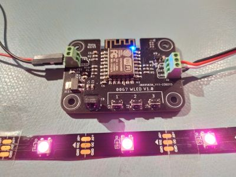

# Tasmodul WLED
A module for WLED or Tasmota to drive WS281x LED strips

## Features
* 3 push buttons (customizable function)
* Infrared receiver for standard remote controls
* Integrated level shifter for 5/12V strips

